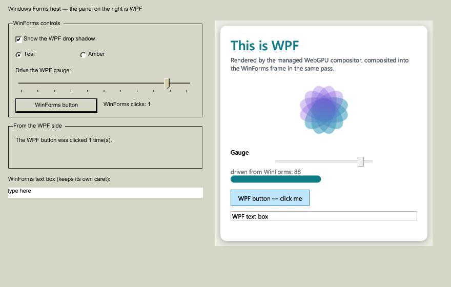

# WPF inside Windows Forms — `ElementHost` on WebGPU

The mirror of [`winforms-in-wpf`](../winforms-in-wpf). There a WinForms control tree is embedded in a
WPF app (`WindowsFormsHost`); here a **WPF element tree is embedded in a WinForms app**
(`ElementHost`), on this fork's cross-platform stack: Mono's managed `System.Windows.Forms` driven by
the `XplatUIWebGpu` driver, hosting WPF rendered by the managed WebGPU compositor.



Left: ordinary WinForms controls, painted through the GPU-raster `System.Drawing` backend. Right: a
WPF element tree — rounded card, drop shadow, gradients, a rotating vector spinner, `Slider`,
`Button`, `TextBox` — inside an `ElementHost`. Both halves are composited by **one WebGPU render pass
onto one surface**.

## What it demonstrates

| | |
|---|---|
| WPF renders inside the WinForms window | the card, its shadow and its vector content are WPF, drawn by `WgpuSceneRenderer` |
| live WPF animation on WPF's own clock | the spinner runs off a WPF `DispatcherTimer` while WinForms is idle |
| WinForms → WPF | the trackbar drives a WPF `Slider`; the radios mutate a shared `SolidColorBrush`; the checkbox adds/removes a WPF `DropShadowEffect` |
| WPF → WinForms | clicking the WPF button updates a WinForms `Label` |
| real input on both sides | the WPF tree is a real `HwndSource`, so it hit-tests, hovers, captures the mouse and takes the keyboard; the WinForms text box keeps its own caret |

## How it works

The WPF side is **ordinary WPF**. The element tree is the `RootVisual` of a real `HwndSource` sized
and positioned to the hosting control, so layout, hit-testing, input, focus, capture, popups,
animation and DPI all work exactly as in a standalone WPF app. None of that is re-implemented.

Only *presentation* changes, via a small bridge added for this:

- `HostedWpfContent.Claim(hwnd)` (in `WgpuInterop`) tells `WpfCompositionSink` **not** to give that
  window a swap chain of its own.
- The sink instead **publishes** the window's decoded root `SceneVisual` each frame.
- `ElementHost.Collect` hands that scene to the WinForms host, which appends it to the driver's own
  control scenes.

So there is no intermediate bitmap, no readback, no second swap chain, and no z-order fight between
two native windows — the WinForms controls and the WPF tree end up in the same scene graph. This is
exactly the shape `EmbeddedContent` already had for the opposite direction, and it now has a
counterpart, `HostedWpfContent`.

The WinForms host files (`Win32Host`, `CocoaHost`, `WgpuPresenter`, `IWinFormsHost`) are **shared
verbatim** with the pure-WinForms `winforms-webgpu-gallery`; the only addition is `EmbeddedScenes`, a
hook the hosts consult for extra scenes and which is inert when nothing is embedded.

### Per-platform

`ElementHost` is available on every head; what differs is what "a child window" means:

| Head | Hosted window | Presentation | Status |
|------|---------------|--------------|--------|
| Windows | real `WS_CHILD` HWND, never painted | claimed → composited into the host's single frame | ✅ verified (this sample, `selftest`) |
| macOS / Linux | borderless platform window (NSWindow / `wl_surface`) owned by the host, positioned over the control — the same construct WPF popups already use there | presents its own surface as an overlay pinned to the control | builds; ⚠ not run — no Mac/Linux box here |

Both use the same code path for placement, sizing, lifetime and the WPF tree itself; only
`ElementHost.CompositeIntoHostFrame` differs. Input is native in both cases (Cocoa and Wayland
deliver into `HwndMouseInputProvider` exactly as for any WPF window). Moves and resizes go through
WPF's own portable windowing seam (`MS.Win32.UnsafeNativeMethods.SetWindowPos`), not `user32`.

## Run

```powershell
dotnet build WpfInWinForms.csproj -c Release
.\bin\Release\net10.0\WpfInWinForms.exe 60          # interactive for 60s (0 = until closed)
```

Click the WPF button and the WinForms button, drag the trackbar, toggle the radios and the checkbox,
type in either text box.

### Self-test

```powershell
.\bin\Release\net10.0\WpfInWinForms.exe 30 selftest    # exit 0 = pass
```

It clicks the WinForms button through the driver, drives the trackbar, and clicks the **WPF** button
with real OS input (`SetCursorPos` + `SendInput`), then asserts both click counters advanced and the
WPF tree is live, saving before/after frames.

> Real OS input means it **moves the actual mouse pointer**. Don't run it alongside another UI test —
> that is what made a neighbouring sample's self-test look broken during development.

Synthetic window messages deliberately do *not* work here: WPF drops mouse messages sent to an
inactive window that has neither capture nor the real cursor over it ("spurious mouse event"), which
is why the self-test drives the OS instead. That it passes is the interesting part — it proves the
hosted tree is hit-testable at the screen position it is *drawn* at.

Diagnostics: `WF_TRACE_INPUT=1` traces the messages the hosted window sees and how WPF routed them;
`WF_WEBGPU_SAVE=<png>` sets where the self-test writes its frames.

## Prerequisites

`build.cmd -configuration Release -platform AnyCPU -warnAsError 0` (populates `artifacts/bin`), and
the `wgpu-native` binary for this RID under `src/Microsoft.DotNet.Wpf/src/WgpuInterop/native/<rid>/`.
